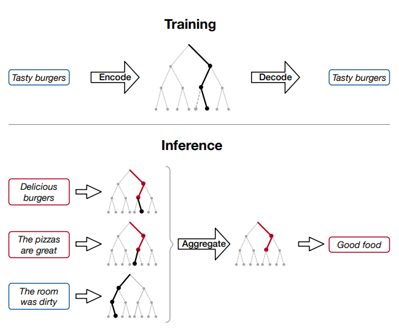
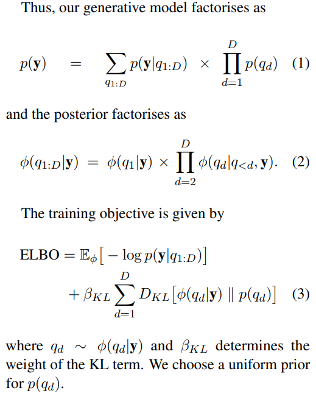
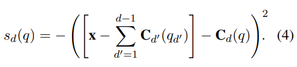
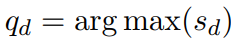
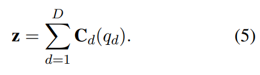
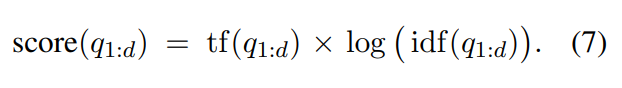
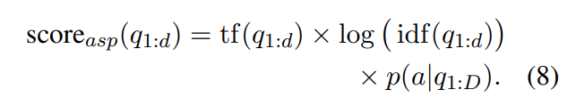
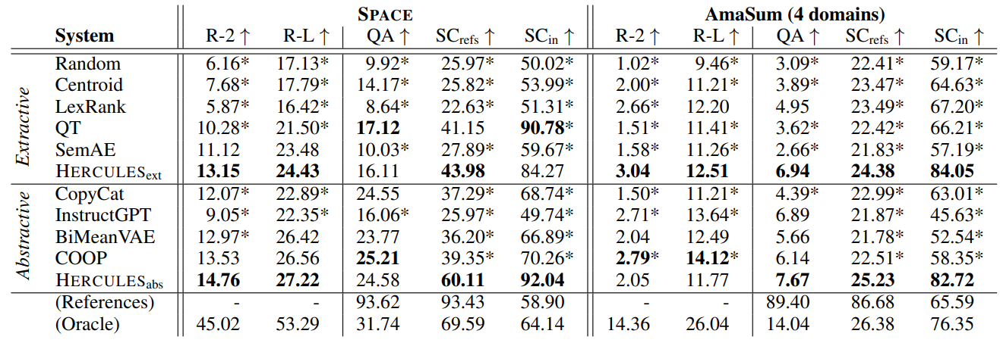

# Attributable and Scalable Opinion Summarization
[原论文地址](https://aclanthology.org/2023.acl-long.473.pdf)
[数据集和代码地址](https://github.com/tomhosking/hercules)

## 评论聚合（意见摘要）面临的挑战
1. 很难获得参考摘要，因此模型训练总是再缺乏gold standard references基础上训练的（21年以前）
2. 热门产品（entities）可能有数百个评论，如果方法的可扩展性差，可能会造成计算困难
3. 希望得到的意见摘要应该是抽象的，剔除一些不必要的细节，但也不能产生包含虚假信息“幻觉”。理想情况下，模型应该是可归因的，提供一些证据来证明其输出（生成摘要）的合理性。

> 先前的工作一部分可归因可扩展，但是生成的摘要太具体（希望是剔除unnecessarily specific details），另一部分生成摘要太抽象包含幻觉，且缺乏扩展性。

## 本论文思想
生成抽象摘要的同时，附上对输入句子的引用，这些引用作为每个输出句子的证据验证输入评论的哪些部分被用于生成摘要。

方法具体为：
1. 将评论中自然语言句子编码为（在分层离散潜在空间的）路径。
2. 给定关于某个特定实体的多条评论语句，确定在这些评论之间共享的公共子路径（common subpaths），并将这些子路径解码回自然语言，生成摘要。这些包含（选出的）子路径（编码后）的句子，充当生成句子的证据。

训练（顶部）：将评论中的句子编码为（在分层离散潜在空间的）路径。图中将“Tasty burgers” 编码为（中间部分）“树”的单一路径，用黑色实线表示。

推理（底部）：对输入评论中的所有句子进行编码，并确定用于摘要的出现频率高的路径或子路径。图中将三个句子“Delicious burgers”，“The pizzas are great”，“The room 
was dirty”输入编码，聚合得到的一致意见（公共子路径）是“Good food”，图中红色显示的子路径是重复的（出现两次，频率最高），解码后应该会产生类似“Good food”的输出。

> 模型（HERCULES）是无监督的，训练过程中不需要参考摘要，而是依赖于模型引导的编码空间的特性。
>
> 可扩展（Scalable）：聚合过程发生在编码空间中，而不是长序列的token。
>
> 可归因（Attributable）：生成的摘要附带来自输入评论的支持性证据。
>
> 一定程度的可控性（controllability）：可以通过将聚合限制在与所需实体属性（方面）相关的子路径上，生成关注实体的特定方面（例如，位置）或情绪的摘要。

## 分层量化自动编码器（对应本论文思想1，得到潜在表示z）
y是一个句子，代表一个tokens序列。

y的语义可以被编码为一组离散潜在变量（编码）q1:D∈[1,K]. 

q1:D按层次排序，q1表示句子的高层次语义信息（例如，方面或整体情绪）而qD表示句子细粒度的语义信息 （例如，使用的具体措辞或词语选择）。句子编码q1:D可以被视为通过层次结构或树的单一路径，如图1所示，其中树中的每个中间节点和叶节点对应于一个句子y（单一路径中，位置高的结点，是该句子高层次语义表示，位置低的结点，是该句子细粒度语义表示，对应的都是同一句子）。

### 概率模型

### 神经参数化
q1:D离散，但大多数神经方法在连续空间中操作。定义从编码器网络的输出z∈RD到q1:D的映射，对于解码器p(y|z)也一样。学习了一个码书（codebook）Cd∈RK×D，它将每个离散代码映射到一个连续嵌入Cd（qd）∈RD（Cd相当于一个词典，一个表，用一个矩阵表示q1:D）

q1:D旨在表示分层信息，因此每个层级编码上的分布是softmax分布，得分sd由从每个codebook embedding到（输入和所有先前级别的累积embeddings之间的残差）的L2距离得出。

解码器的输入z由q1:D得出：

> 可以不指定路径到完整深度D，子路径q1:d（d＜D）仍然可以得到z。并且，可以通过改变编码（路径）深度来控制编码的特定性。

## 在编码空间中聚合评论（对应本论文思想2，使用潜在表示z）

### 子路径选择（解码器解码效果的关键）

选择出现频率最多的？ 容易选到q1。

因此需要权衡频率和特定性。好的摘要往往表现出结构，通常包括高级别的评论，以及关于细节的更具体的评论，这些评论能将当前实体与其他实体区分开来（评论中往往存在实体的“对比”）。例如，AMASUM数据集包括对某一产品的verdict、pro、cons。

本文提出的选择子路径的方法考虑通用和特定两方面。（generic and specific）

选择通用子路径：
1. 将（编码后的）输入句子集合构建一个概率树，其中节点权重设置为观察到的路径频率p(q1:d)。
2. 迭代地修剪树，移除概率最低的叶子，直到所有的叶子权重都超过一个阈值，min(p(q1:d))>0.01。
3. 最后，选择权重top k的叶子用于生成摘要。从经验上讲，这种方法通常选择深度d=1的路径，但当更深层的子路径被特别强烈表示时，允许这种灵活性。

选择特定子路径：（tf-idf）
1. 将每条路径（及其所有父亲的子路径）视为terms。
2. 将分数分配给每个子路径q1:d，与它在当前实体中的频率成正比，与子路径出现的实体数量成反比。
3. 再次，选择得分top k个子路径用于生成摘要。

### 可归因性
最终生成摘要中的每个句子都有一个相关的子路径。通过识别共享该子路径的所有输入，可以构建一组证据语句，作为生成输出的解释或理由。

### 可扩展性
由于聚合是在编码空间中执行的，随着输入句子的数量线性扩展，可以处理大量的输入评论。

但由于使用基于频率的方法来识别重要意见，因此当输入评论的数量较少时，本方法表现不佳（对于哪些意见是常见的，无监督的，没有强烈的信号）

### 控制输出
控制生成摘要关注特定方面：

给定一个方面词a（例如，“服务”），我们获取了一组与该方面相关的关键词Ka（例如，“工作人员、友好、无益、礼宾”）。我们用方面词a标记训练数据中的每个句子，如果它包含任何相关联的关键字Ka，则计算每个编码路径的概率分布，p(a|q1:D)。可以修改方程（7）中的评分函数，将聚合时子路径得分乘以方面对应概率，从而增加与该方面相关路径的权重。

控制生成摘要的情绪：

对于评论附带得分（rating，AMASUM中有，代表情感极性分数，1-5分，分数越高越积极，分数越低越消极）的情况，可以用整体评论的情感得分r作为每个评论句子（及其子路径）的标签，并在聚合时通过希望得到的得分p(r|q1:D)的似然函数来重新加权子路径得分。

## 模型评估结果

## 读完论文的一些问题和理解
1. 读该论文的初衷是我正在做的摘要模型也是基于AMASUM数据集的，这篇论文是基于SPACE和AMASUM，我的疑问是，该论文模型效果评估为什么没有与AMASUM原论文提出的SELSUM模型对比效果？有没有可能比不过SELSUM？
2. 该模型的评估参数用了R-2，R-L。没有用R-1？当然可能该模型生成摘要的效果偏向转述（公共子路径）？
3. 目前做生成任务，大概率都是要与chatGPT（InstructGPT）的效果进行对比的，这也是我们之后模型评估中无法避免的点。
4. 该模型的评估还采用了基于QA的评估方法，以及基于NLI的评估方法（SummaC），这也是从之前了解学姐做的工作，发现大家慢慢不只用ROUGE指标（存在问题）做评估。
