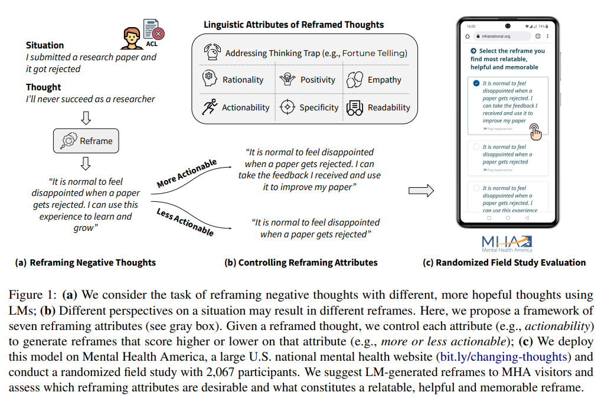

# Cognitive Reframing of Negative Thoughts through Human-Language Model Interaction

[原论文地址](https://arxiv.org/abs/2305.02466)

[原代码和数据地址](https://github.com/behavioral-data/Cognitive-Reframing)

## 面临的问题
（NLP方法）解决消极思想的认知重构。
> 例如：“我正在向ACL 2023提交一篇研究论文”，一种消极想法“这篇论文会被拒绝。”，这种想法的一种可能重构方法是说“由于其新颖的方法和潜在的影响，这篇论文有一定的机会被接受。”
>
> 为什么需要NLP方法解决？人为解决难（1. 缺乏心理治疗条件/医生 2.社会对心理健康的偏见）

## 本论文主要工作
1. 如何使用语言模型（LMs）来重新定义消极想法。图中（a）
2. 如何重新定义消极想法，如何利用LMs来进行这种重构。图中（b）
3. 有消极想法的人更喜欢什么类型的重构。图中（c）

## 认知重构任务的定义和目标
给定情景
$S_{i}$
和消极想法
$T_{i}$
，得到重构想法
$R_{i}$

## 七个重构想法的语言属性
1. 解决思维陷阱
2. 合理性
3. 积极性
4. 移情性
5. 可执行性
6. 特定性
7. 可读（可理解）性

## 重构属性的评估方法
1. 解决思维陷阱->微调GPT3（多标签分类任务）
2. 合理性->溯因推理
3. 积极性->RoBERTa-based情绪分类器在TweetEval上微调
4. 移情性->RoBERTa-based模型模拟由三种移情沟通机制（情绪反应、解释和探索）组成的理论基础的移情框架，并预测了心理健康对话中的移情水平，范围从0到6。在这里，我们通过一个手动标记的数据集（由一位在心理健康背景下具有同理心专业知识的作者标记），在重构思想的领域进一步微调了这个模型。
5. 可执行性->（a）将行动是否具体视为二元分类任务,prompting GPT-3进行10次重构想法测试，预测contains_action(Ri) ∈ {0, 1}。（b）给定一个重构想法，prompting GPT-3（零样本）生成k=5个下一个动作候选者。计算下一个动作的连贯性表示为next_action_coherence（Ri），使用RoBERTa对k个动作候选者中的每一个编码并计算平均成对余弦相似度。相似性越高，表示可能的下一步行动之间的一致性越强。我们的总体可操作性测量定义为contains_action（Ri）+ next_action_corrence（Ri）。
6. 特定性。[Ri]与[Si,Ti]的之间的句子embedding相似性。
7. 可读性。采用Coleman-Liau Index（CLI）指标，该指标根据一个句子中的字符和单词结构来评估可读性。CLI=0.0588L−0.296S−15.8，其中L：每100个单词的平均字母数；S是每100个单词的平均句子数。

## 重构想法生成
基于上下文检索的学习方法。对于每一组Si和Ti，从数据集中检索k个相似的样本。首先使用RoBERTa对Si和Ti进行编码。然后，我们检索k个例子，{(s1，t1),...,(sk，tk)}，基于cosine_sim(concat(s,t),concat(Si,Ti)).我们选择k=5。

## 控制（生成的）重构想法的语言属性
> 类似对比学习需要知道相似与不相似
### 解决思维陷阱
生成两个重构想法
$R_{i}^{(tt,Y)}$
和
$R_{i}^{(tt,N)}$
Y代表解决了思维陷阱，N代表未解决思维陷阱。

从数据集中分别提取两组上下文中的例子，一组是至少解决了一个思维陷阱的例子，另一组是没有解决的例子。利用这些例子prompt GPT3。

### 其他六个属性
对于属性a，生成两个重构想法
$R_{i}^{(a,H)}$
和
$R_{i}^{(a,L)}$
H代表在a上得分较高，L代表在a上得分较低。
利用a属性上的高分例子做低分重构想法生成，利用a属性上的低分例子做高分重构想法生成。

## 论文中的一些实验结论
**人们更偏好哪种重构想法？**
1. 多数人偏好高移情性、具体的重构想法
2. 少数人偏好过于积极的重构想法

**理想重构于语言属性的对应结果**
> 理想重构想法：
>
> （a）与个人相关性强
>
> （b）有帮助（克服消极想法）
>
> （c）下次出现类似的消极模式时，会记得该重构想法。

1. 合理性高的重构想法，相关性强。（a）
2. 解决思维陷阱、可执行性高、具体性高的重构想法更有帮助。（b）
3. 可执行性高、具体性高的重构想法容易让人记住。（c）
