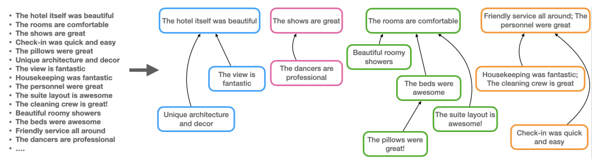
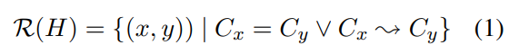

# From Key Points to Key Point Hierarchy: Structured and Expressive Opinion Summarization

[原论文地址](https://aclanthology.org/2023.acl-long.52.pdf)

[github仓库地址](https://aclanthology.org/2023.acl-long.52.pdf)

## 面临问题
Key Point Analysis（KPA，关键点分析）的局限性：

关键点分析最近被用于从文本评论集合中获得细粒度的信息，KPA将数据中的要点提取为简洁的句子或短语列表，称为关键点，并量化其流行程度。虽然关键点比词云（word clouds）和关键短语（key phrases）表达性更强，但理解一长串扁平的关键点对模型来说可能仍然很困难（这些关键点通常以不同的粒度表达相关的想法）。

> 什么是KPA？[参考](https://github.com/IBM/KPA_2021_shared_task)
> 
> 关键点分析（KPA）是一项2020年提出的NLP任务，与计算论证、意见分析和摘要有着密切的关系。
>
> 一个输入语料库，由一组相对较短的主观文本组成，集中在感兴趣的主题上，KPA的目标是生成一个简洁的列表，列出输入语料库中最突出的关键点及其相对流行性。因此，KPA的输出是一个项目符号式摘要（bullet-like summary），从一个重要的定量角度，并且有一个相关的明确的评估框架。KPA的成功解决方案可用于从社交媒体、调查等中表达的公众意见中获得更好的见解，从而在决策者和可能受到决策影响的人之间形成一种新形式的沟通渠道。
>
> 对每个关键点的匹配计数，并且论据对应关键点（多对一）

## 本论文思想
为了解决KPA的局限性：关键点列表扁平，关键点之间没有（层次）关系。

提出Key Point Hierarchies（KPH，关键点层次结构），相当于文本蕴含图，可以更好的突出关键点的层次，快速掌握高层次主题，再对高层次主题（关键点）深入了解到更精细的低层次细节（关键点）。

KPA（左部）：关键点列表
KPH（右部）：高层次主题（the hotel is beautiful，the shows are great，comfortable rooms，great service），更精细的信息（从“The personnel were great” 到“check-in was quick and easy”）。对于表达含义相同的关键点（例如，“House-keeping was fantastic”, “The cleaning crew is great”）会聚合表示为层次结构中的一个单结点。

> 由KPA到KPH，KPH省略了KPA的关键点匹配词数，因为已经将细粒度的关键点连接到高层次的关键点。

## 本论文的主要贡献
1. KPH
2. 数据集THINKP

## KPH
关键点列表：K = {k1,k2,...,kn}

KPH：H=(v,ε) H是一个有向森林，即有向无环图（DAG），每个结点只有一个父结点。

顶点v是关键点集合{C1,…mCm}，并且有向边εij∈ε表示Ci和Cj之间的层次关系。

有向边Ci→Cj表示关键点Ci为关键点Cj提供解释和支持（论据）。利用传递性，这种关系扩展到任何两个Ci和Ck，使得在H中存在从Ci到Ck的有向路径，我们将其表示为Ci~→Ck，因此，我们将R(H)定义为从H导出的关键点对(x,y)之间的有向关系集合：

