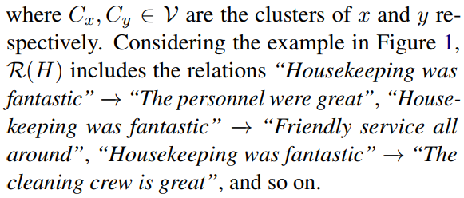
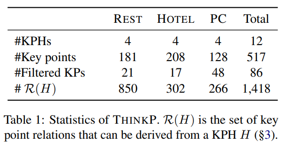
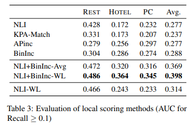
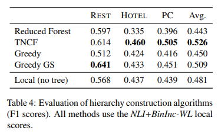

# From Key Points to Key Point Hierarchy: Structured and Expressive Opinion Summarization

[原论文地址](https://aclanthology.org/2023.acl-long.52.pdf)

[github仓库地址](https://github.com/IBM/kpa-hierarchy)

## 面临问题
Key Point Analysis（KPA，关键点分析）的局限性：

关键点分析最近被用于从文本评论集合中获得细粒度的信息，KPA将数据中的要点提取为简洁的句子或短语列表，称为关键点，并量化其流行程度。虽然关键点比词云（word clouds）和关键短语（key phrases）表达性更强，但理解一长串扁平的关键点对模型来说可能仍然很困难（这些关键点通常以不同的粒度表达相关的想法）。

> 什么是KPA？[参考](https://github.com/IBM/KPA_2021_shared_task)
> 
> 关键点分析（KPA）是一项2020年提出的NLP任务，与计算论证、意见分析和摘要有着密切的关系。
>
> 一个输入语料库，由一组相对较短的主观文本组成，集中在感兴趣的主题上，KPA的目标是生成一个简洁的列表，列出输入语料库中最突出的关键点及其相对流行性。因此，KPA的输出是一个项目符号式摘要（bullet-like summary），从一个重要的定量角度，并且有一个相关的明确的评估框架。KPA的成功解决方案可用于从社交媒体、调查等中表达的公众意见中获得更好的见解，从而在决策者和可能受到决策影响的人之间形成一种新形式的沟通渠道。
>
> 对每个关键点的匹配计数，并且论据对应关键点（多对一）

## 本论文思想
为了解决KPA的局限性：关键点列表扁平，关键点之间没有（层次）关系。

提出Key Point Hierarchies（KPH，关键点层次结构），相当于文本蕴含图，可以更好的突出关键点的层次，快速掌握高层次主题，再对高层次主题（关键点）深入了解到更精细的低层次细节（关键点）。


KPA（左部）：关键点列表
KPH（右部）：高层次主题（the hotel is beautiful，the shows are great，comfortable rooms，great service），更精细的信息（从“The personnel were great” 到“check-in was quick and easy”）。对于表达含义相同的关键点（例如，“House-keeping was fantastic”, “The cleaning crew is great”）会聚合表示为层次结构中的一个单结点。

> 由KPA到KPH，KPH省略了KPA的关键点匹配词数，因为已经将细粒度的关键点连接到高层次的关键点。

## 本论文的主要贡献
1. KPH
2. 数据集THINKP

## KPH
关键点列表：K = {k1,k2,...,kn}

KPH：H=(v,ε) H是一个有向森林，即有向无环图（DAG），每个结点只有一个父结点。

顶点v是关键点集合{C1,…mCm}，并且有向边εij∈ε表示Ci和Cj之间的层次关系。

有向边Ci→Cj表示关键点Ci为关键点Cj提供解释和支持（论据）。利用传递性，这种关系扩展到任何两个Ci和Ck，使得在H中存在从Ci到Ck的有向路径，我们将其表示为Ci~→Ck，因此，我们将R(H)定义为从H导出的关键点对(x,y)之间的有向关系集合：




## THINKP数据集
手动构建（作者在论文附录中给出了数据标注指南）

包含积极、消极（分别的）关键点摘要，源数据来源：Yelp、Amazon

数据集的统计数据：



THINKP数据-Hotel1.txt-“树”的形式举例：
```
The show was very entertaining!
	|- Some of the dancing and gymnastics are amazing.
		|- Last act and dance was so fun!
	|- The ambiance rocks.
		|- Costumes were beautiful.
		|- The colors were fun and vibrant.
		|- The music and acoustics were amazing.
			|- The sound is great every where.
			|- the soundtrack CD to the show is awesome!
	|- The choreography with the music is great.
	|- Great for kids!
		|- Great for a family.
	|- The different settings was pretty cool.
	|- The energy is great.
	|- The performers are so extremely talented.
		|- the skaters were awesome.
	|- The pre-show acts are hilarious.
The theatre is great.
	|- All seats are good seats.; Any seat has a good view.
	|- Balcony seats are the best seats hands down.
	|- Nosebleed seats are the best!
	|- Stage has unique angles.
	|- The entrance is absolutely beautiful.
	|- The seats were very comfortable.
	|- The stage is centered which is really nice.
	|- The theater is custom built for the show.
	|- The theater is small and intimate.
Ticket price was great.
The drinks were actually reasonably priced.
The staff were courteous and really helpful.
No issues in or out.
Starts on time too !
```
THINKP数据-HOTEL1-json格式举例：
```
{"viz_file_name": "HOTEL1.txt", "kps": ["The music and acoustics were amazing.", "The show was very entertaining!", "Some of the dancing and gymnastics are amazing.", "All seats are good seats.", "Any seat has a good view.", "The choreography with the music is great.", "The performers are so extremely talented.", "Costumes were beautiful.", "The energy is great.", "The theatre is great.", "Ticket price was great.", "The ambiance rocks.", "The theater is small and intimate.", "The colors were fun and vibrant.", "Stage has unique angles.", "The stage is centered which is really nice.", "the soundtrack CD to the show is awesome!", "Last act and dance was so fun!", "The sound is great every where.", "Great for kids!", "the skaters were awesome.", "Great for a family.", "The different settings was pretty cool.", "The seats were very comfortable.", "The entrance is absolutely beautiful.", "The drinks were actually reasonably priced.", "Balcony seats are the best seats hands down.", "The theater is custom built for the show.", "The staff were courteous and really helpful.", "Nosebleed seats are the best!", "The pre-show acts are hilarious.", "No issues in or out.", "Starts on time too !"], "clusters": [[0], [1], [2], [3, 4], [5], [6], [7], [8], [9], [10], [11], [12], [13], [14], [15], [16], [17], [18], [19], [20], [21], [22], [23], [24], [25], [26], [27], [28], [29], [30], [31], [32]], "relations": [[8, 3], [8, 25], [8, 28], [8, 13], [8, 23], [8, 22], [8, 14], [8, 26], [8, 11], [1, 2], [1, 10], [1, 4], [1, 18], [1, 21], [1, 7], [1, 5], [1, 29], [5, 19], [18, 20], [10, 6], [10, 12], [10, 0], [0, 17], [0, 15], [2, 16]], "topic": "mz9ltimeAIy2c2qf5ctljw_pos", "domain": "Hotel"}
```

## 自动构建KPH数据
### 评分（关键点之间的关系）
1. Baseline：NLI方法（RoBERTa fine-tuned on MNLI）/KPA-Match（RoBERTa trained on Arg-KP）
2. 引入方向分布相似性：希望KPH中关键点对应的匹配能更加合理。APinc、BinInc...
3. 将NLI与分布方法结合：NLI+BinInc-Avg、NLI+BinInc-WL

### 层次构建
希望生成一个KPH，使得该结构产生的成对关键点关系集合与局部方向性得分一致：高分关系应包括在内，低分关系应排除在外。文中探索了几个用于构建KPH的选择。（每一种都在局部得分上采用了决策阈值τ，这需要在一些开发数据上进行调整。）

1. Reduced Forest
2. TNCF
3. Greedy
4. Greedy GS
> 具体方法后面需要用的时候再看

## 评估
### “预测局部关键点对关系”方法评估。
准确率-召回率曲线（目标是获得同时具有高准确度和召回率的分类器，在图形上的表现是曲线与坐标轴围成的区域面积尽可能大。）




局部方法最好的是：NLI+BinInc-WL

### “层次构建” 方法评估



## 读完论文的一些问题和理解
1. 结合Attributable and Scalable Opinion Summarization论文，发现目前的意见摘要方法比较关注，对评论中信息的层次构建。Attributable and Scalable Opinion Summarization论文是构建路径，找到公共子路径得到更高层次的信息，并且子结点是父结点的细粒度表示。而本篇论文提出的KPH结构，也是对文本评论中关键点的层次构建，高层次表示更像是主题，低层次表示更多细节。两篇论文都关注生成的“论据”，另一篇论文是将包含子路径的结点作为利用子路径生成摘要内容的论据，本论文通过不同的评分/构建方法，结合了NLI，期望得到的层次对应关系更合理，子层次作为父层次的论据。

> 不同的是，另一篇论文是通过分层结构编码训练（模型），本论文是在构建KPH时就先将关键点找出，再构建好层次结构（数据处理方法）。
>
> 相同的是，都用到“层次”的思想，目的都是为了希望摘要“详略得当”。都关注“论据”，希望生成的摘要会减少“幻觉”，更具支撑力。

2. 该论文创新的点在KPH方法，评估部分只是对自己的多种构建选择区分，并没有真正应用在下游任务中去题先效果到底好不好？例如作者使用了Yelp、Amazon数据集，但并没有去将自己的结构应用到某个模型去体现一下评估指标的提升，这个待后续使用来发现。
3. 关键还是在“想法”，实现的方法大多都是别人方法的微调。
