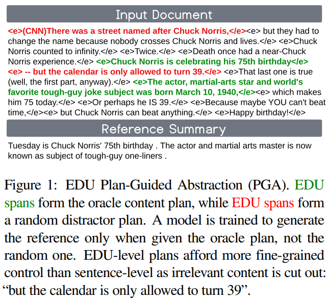
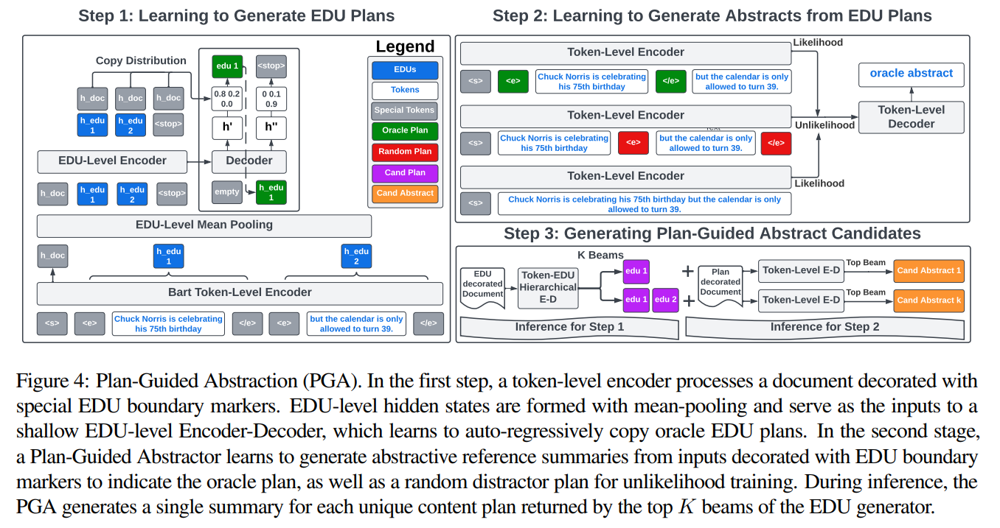

# Generating EDU Extracts for Plan-Guided Summary Re-Ranking

[原论文地址](https://aclanthology.org/2023.acl-long.151.pdf)

## 论文摘要
two-step方法，是指在生成摘要候选后重新排序，以返回单个摘要的方法，与比标准一步方法相比可以提高ROUGE得分。然而，标准解码方法(如波束搜索（beam search）、核心样本（nucleus sampling）、多样化波束搜索（diverse beam search）)会产生冗余，往往是质量较低的内容。为了解决该问题，设计了一种新方法通过重新排序生成摘要候选者。将每个候选摘要建立在其独特的内容计划上，并使用模型的top beam生成计划指导(plan-guided)的摘要。具体来说，一个标准语言模型(一个BART LM)自回归地使用提取复制机制生成基本语言单元(Elemental Discourse Unit，EDU)内容计划。内容计划生成器中的top K beams然后将用于指导一个单独的LM，为每个特定计划生成一个单独抽象候选者。将重新排序器(BRIO)应用于生成摘要候选者的过程，也是解码方法的基准。的方法在CNN / Dailymail、NYT和Xsum中，ROUGE-2 F1得分分别提高了0.88、2.01和0.38。CNN/DM的人类评估验证了这些结果。类似地，在CNN/DM中的1,000个样本中，发现提示GPT-3按照EDU计划比基于样本的方法在ROUGE-2 F1得分上提高了1.05个点。

## 面临的问题
1. 句子级别（sentence-level）的划分不够细粒度，EDU的划分更细粒度（与摘要任务中关注的方面更加契合）
2. 现有方法存在的缺陷：（1）根据rouge值得到重排序得分高的候选者不一定信息性最好。（2）候选摘要不缺乏多样性。本文方法正式根据DCP生成摘要，去探索候选摘要的多样性。

## 主要工作

> 内容计划（content plan）：源文档的一组不重叠的文本片段。
>
> EDU（Elemental Discourse Unit）：EDUs代表句子独立子句，支持比句子级别提取更细粒度的抽取。本文将EDUs作为content paln的合适的粒度。
>
> DCP（Derived Content Plan）：对应某个摘要的多个EDU的无序集合。

1. 训练阶段：学习如何生成EDU plans
2. 训练阶段：学习如何根据EDU plans生成摘要
3. 推理阶段：生成plan-guided的候选摘要

> Oracle Plan：贪婪选择方法得到的EDU plan
>
> Random Plan：随机干扰的EDU plan
>
> 在step2中训练模型从Oracle plan中去生成候选摘要（likelihood），而不是从Random plan（unlikelihood）
>
> 注意EDU是用开头结尾的<e></e>一组标记表示两个标记中的内容为一个EDU

