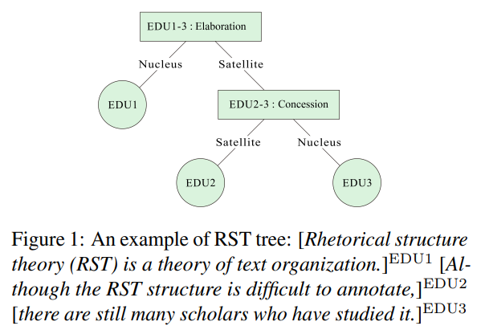
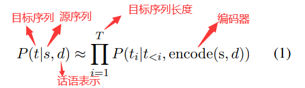
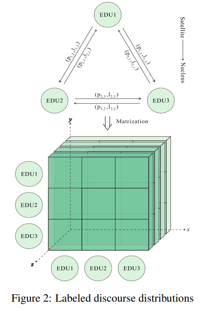
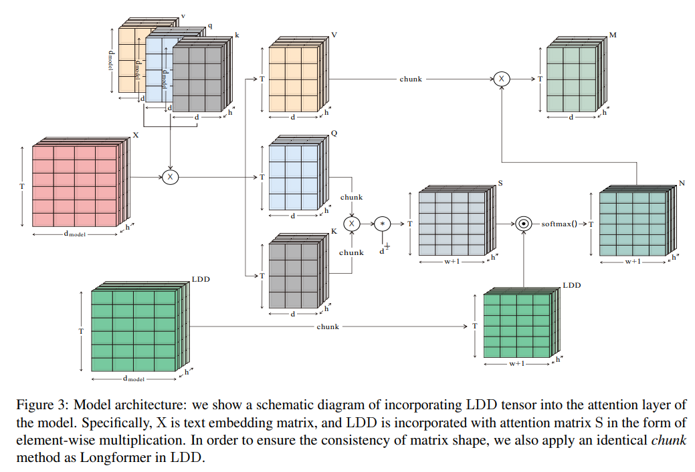

# Incorporating Distributions of Discourse Structure for Long Document Abstractive Summarization

[原论文地址](https://aclanthology.org/2023.acl-long.306.pdf)

## 面临问题
> 对于写一篇长文档的摘要来说，辨别文本中的显著信息并理解其各个组成部分之间错综复杂的相互联系至关重要。
>
> 对于文本摘要来说，语篇结构在识别文本核心内容方面起着至关重要的作用。

1. 目前的长文本摘要方法是基于Transformer的encoder-decder架构，这些seq2seq模型首先将源文档转换为高维表示，然后对基于该表示解码得到预测的摘要。之前有工作已经证明了这种架构在编码阶段挖掘高级话语结构的工作做得很差。**话语结构对生成的摘要中包含哪些或不包含哪些部分十分重要（之前工作证明）**

2. 之前分割语篇结构的文本摘要工作不使用关系标签，只考虑从discourse parser的预处理中获得的最好的1个RST树。**关系相关信息被忽视**，并且之前有工作说明了**考虑相关关系标签上的分布可能会有好处，而不是用1-best**。可能原因：（1）external discourse parser是在领域之外的数据上表现不佳，并因此可能将错误传播到摘要模型中，随着反向传播这种错误被放大。（2）文本中可能有几个连贯关系同时存在，这有利于通过话语结构的分布来表示。

## 主要工作
> RST（Rhetorical Structure Theory，修辞结构理论）：作为一个话语框架，旨在在文档层面阐明句子之间的内在关系。下面是一个RST树的例子：
> 
> EDU1 作为Elaboration的核心（Nucleus），EDU2&EDU3作为为Elaboration的附属（Satellite）。concession是Elaboration的下一级，其中：EDU3 作为concession的核心，EDU2作为concession的附属。
>
> 重要性来说，EDU1>EDU2>EDU3。如果省略EDU2，EDU1和EDU2之间的阐述关系仍然成立，但如果去除EDU3，EDU1和EDU2间的阐述关系将不成立，并且连贯性也会失去。

**RST+Longformer->RSTformer**

## 方法
**将局部关系的概率分布集成到Longformer的注意力窗口w中**
### 1. 如何得到带标记分布的RST Tensor（LDD）

x,y轴代表EDUs，z轴代表discourse relation，每一个点代表一个置信值
$p(edu_{i},edu_{j},l)∈[0,1]$

LDD张量的生成应满足：（1）
$p(edu_{i},edu_{j})=0$
，代表没有EDU依赖于自己。（2） 只提取nucleus EDUs的关系概率，因为nucleus EDU在文本中更为核心，应该给予更多的关注。例如在之前的RST树的例子中，只提取EDU1和EDU3的关系概率。

### 2. 如何得到RST Sparse Attention
本能提出的RSTformer以话语感知的方式将LDD合并到Longformer编码的每一层中。每一层share相同的configuration，模型的一层架构如下：

