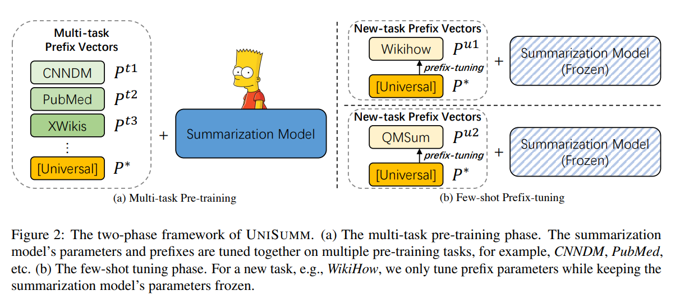

# UNISUMM and SUMMZOO: Unified Model and Diverse Benchmark for Few-Shot Summarization

[原论文地址](https://aclanthology.org/2023.acl-long.718.pdf)

[代码地址](https://github.com/microsoft/UniSumm)

## 面临问题

目前的小样本摘要模型的训练范式忽略了各式各样数据集中潜在的可共享知识。

### 小样本文本摘要基线模型
在预训练模型的基础上，prefix-tuning在许多小样本文本生成任务中表现出了强大的性能。

fine-tuning需要微调语言模型所有参数，每个任务都需要保存一遍所有的模型参数。prefix-tuning致力于如何不改变语言模型参数的方式，增加一些任务相关的（task-specific）额外的参数，希望效果甚至超过finetune（降本增效）

前缀调整（Prefix-tuning） 在语言模型中添加额外的、可训练的参数作为前缀（Prefix），并在训练过程中冻结语言模型的参数，仅调整前缀参数。但相关研究表明，prefix-tuning在文本摘要表现上并不稳定，有时甚至劣于一般的精调方法（fine-tuning）。这可能是因为语言模型本身的预训练任务与文本摘要任务训练目标间存在巨大差距。

另一方面，尽管存在各式各样的文本摘要数据集，每当有新的文本摘要数据集提出时，许多研究还是仅在新数据集上对模型进行训练（调PLM）。这种忽视了原本已有数据集的方式，造成了一种标注和知识的浪费，并且这可能会限制模型的泛化和自适应能力。

### 小样本文本摘要基准数据
目前小样本文本摘要研究缺乏一个统一的评价基准。过去的研究一方面集中只关注一类文本的研究（如：新闻摘要或对话摘要），这导致很难评估模型在不同类型文本上的泛化能力。

另一方面，过去研究训练所用的样本并不公开。而小样本学习对数据非常敏感，这会造成样本选择误差（Sample Selection Bias）的问题。

这两点问题导致过去小样本文本摘要的研究之间无法比较。

本文研究的小样本文本摘要场景。如何利用以往摘要数据集（如：CNNDM）去提升模型在未见过文本摘要任务（如：DialogSum）上的小样本学习性能。

## 本论文思想
提出了UNISUMM来解决问题：一种可以利用以往摘要数据进行预训练并通过前缀调整在未见过的小样本文本摘要任务（unseen task）上表现出色的模型。

提出了SUMMZOO：一个包含多样文本摘要任务并能够分析模型稳健性的小样本文本摘要基准数据集。

## UNISUMM

对小样本文本摘要任务定义如下：

对于一个特定的、未见过的看不见的目标摘要任务u，给定输入文本X，文本摘要模型通过学习任务u的k（k≤100）个标注样本的u，生成对应的摘要Y。同时，文本摘要模型可以利用来自预训练语言模型或其他相关数据集的通用知识K。

UNISUMM的整体框架由两个阶段组成：
1. 多任务预训练阶段：通过在现有摘要数据集上进行多任务预训练来学习通用知识。
2. 小样本学习阶段：通过对每个特定小样本数据集进行前缀调整来学习特定文本摘要任务知识。

（a）多任务预训练阶段。此阶段中，摘要模型参数和不同前缀一起调整。（b）小样本学习阶段。给定一个新任务（如，WikiHow），仅调整前缀参数，而冻结摘要模型参数。

**通用前缀怎么获得？**

在多任务预训练阶段，我们初始化通用的编码器和解码器前缀向量，
$P^{\*} = [P_{en}^{\*};P_{de}^{\*}]$
，对于来自任务t的每个训练实例，特定前缀
$P^{t}$
有15%的概率替换为通用前缀
$P^{\*}$
。然后在前缀调整中，我们使用这个通用前缀作为不可见任务参数θpu的初始化。

### 带前缀的多任务预训练

如图2（a）所示，在第一阶段，给定一个由θ参数化的基于Transformer的编码器-解码器预训练语言模型（例如，BART）M=[Men;Mde]。将M在一组文本摘要数据集（例如，CNNDM、PubMed和XWiki）上进一步预训练，以学习通用摘要知识。对于每个任务t，都在模型中额外加入编码器-解码器前缀，Pt=[Pten;Ptde]（由θpt参数化），这些前缀向量被加到M的每一层。

对于所有的预训练任务，给一个输入文本X，多任务的优化目标是最小化输出目标摘要Y={y1,y2,...y|Y|}的负对数似然。

在此阶段，θ和θpt都被优化。

### 前缀调整
通过多任务预训练学习，UNISUMM已经具备了多样的摘要知识。如图2（b）所示，给定k个来自新的文本摘要任务u的标注数据（如，WikiHow或MultiNews），使用前缀调整来优化模型。

具体地，对于任务u，我们构建一个新的前缀参数
$P^{u} = [P_{en}^{u};P_{de}^{u}]$
（由
$θ_{P^{u}}$
参数化）。这个新的前缀参数既可以随机初始化，也可以由第一阶段预训练任务的前缀参数化。之后，冻结摘要模型的参数θ，仅利用上述公式来对
$θ_{P^{u}}$
进行优化。

### 进一步提升小样本学习能力
两种提升模型性能的策略：

1. 在第一阶段的多任务预训练中，训练了一个通用前缀（universal prefix），可以作为第二阶段前缀调整的初始化。
2. 在第一阶段中，使用一个非对称权重衰减（Asymmetrical Weight Decay）策略来对前缀和摘要模型的参数分别进行约束。

实验表明，两种策略都能进一步提升模型性能。

## SUMMZOO
针对目前小样本文本摘要评估方面的两个问题：1.评估的数据集缺乏多样性 2.不同论文使用的小样本不公开，无法横向比较模型性能。

SUMMZOO基于两个原则：任务多样性，评估鲁棒性

### 任务多样性
选择了8种不同的摘要任务，包括独白/对话文本、单文档/多文档摘要、领域涵盖新闻、科学论文、说明书、在线论坛和会议等。

### 评估鲁棒性
为了减少小样本的不同选择带来的随机性，对于每个任务，提供了5组不同的小样本训练数据。

所有模型在这5组样本上分别训练，并报告其平均结果和标准误差。SUMMZOO包括两种小样本场景，小样本数量k分别设置为10和100，其中k=10可以被视为更极端的低资源场景，而k=100是更常见的设置。

## 模型评估结果
### 8个摘要任务的结果

主要结果（UNISUMM也是基于BART的）

对应的是1个样本的GPT3.5和10样本/100样本UNISUMM的R2指标对比

### 模型鲁棒性

## 模型局限性
1. 多任务训练耗费大量GPU资源。
2. 当前框架使用固定长度前缀，不同摘要任务偏好的前缀长度可能不同。
3. 本结构专注于英文摘要场景，其他语言的有待探索。

## 读完论文的一些问题和理解
1. 模型评估对比GPT3.5和UNISUM的R2指标，GPT用的1样本，UNISUM用的10样本/100样本，GPT3/5/10样本的效果会比UNISUM的指标高？
2. 前缀调整第一次了解到（2021年提出的），目前还是finetune的方法更广泛应用？（HuggingFace finetune），结合最近在做的项目，大多数PLM还是考虑非少样本的情况微调，这种少样本方法适用场景是否广泛？
3. 多任务的prefix-tuning是否多任务fine-tuning更耗费GPU资源？ 样本量大时还是由优先考虑fine-tuning？单任务的时候呢？
4. prefix-tuning技术可以提高finetune效率，P-tuningv2版本主要是基于P-tuning和prefix-tuning技术（chatglm应用p-tuningv2已有性能提高）  [P-tuningv2原论文（ACL2022）](https://arxiv.org/pdf/2110.07602.pdf)
