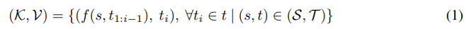
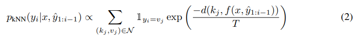
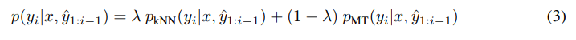
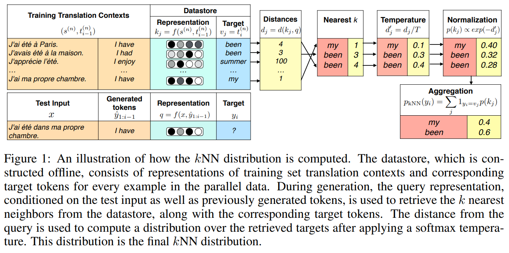

# NEAREST NEIGHBOR MACHINE TRANSLATION

[原论文地址](https://arxiv.org/pdf/2010.00710.pdf)

[代码地址](https://github.com/urvashik/knnlm)

## 引言
当前的深度学习算法主要是参数化的算法，需要通过训练数据来进行参数更新。在数据算力充足的场景下，这一类的方法是直接并有效的。但是当任务包含不同领域的数据时，就需要对其进行逐一微调，产生的成本是比较大的。并且在实际场景中，数据往往不是提前能获取完的，而是有一个逐步构建的过程。在这种常规的参数化方法不能够满足全部的需求的场景下，基于预训练好的模型，在不更新参数的前提下能用新数据提升模型效果的无参算法便有了用武之地。

无参的方法近年来已经在语言建模、问答等领域得到成功的应用。这类方法具有以下的特性：
1. 表达能力强。在测试阶段可以使用任意数量的数据。
2. 适应度高。预测结果可以通过存储的数据改变。
3. 可解释性强。预测所用的数据可以直接被检索到。

## kNN-MT
kNN-MT正是这样的一种无参方法，它可以在任意训练完的神经机器翻译模型的基础上，通过构建检索表（Datastore）进行k近邻的检索，大幅提升其在域内、域外、多语言等场景下的表现。在传统的神经机器翻译模型中，每一步的token预测与解码器输出进行softmax后的目标token分布直接相关。而kNN-MT则是在这个分布的基础上，引入Datastore存储样本，在预测时进行k近邻的检索，找到上下文表示最相近的目标token，再与已知的目标token 分布相结合进行目标token的预测。

**核心问题就是如何进行Datastore的构建和如何使用Datastore辅助token预测。**

## Datastore构建
输入的源语言token序列
$s＝(s_{1},...,s_{M_{1}})$
，神经机器翻译（MT）模型输出目标语言tokrn序列
$t＝(t_{1},...,t_{M_{1}})$
。当使用自回归解码器时，目标序列中每个token
$t_{i}$
的输出分布以整个源序列以及之前的目标tokens 
$p(t_{i}|s, t_{1:i-1})$
为条件。
设
$(s,t_{1:i-1})$
为翻译上下文，
$t_{i}$
为目标标记。

kNN-MT建立在**对于表示空间里相近的文本，它们后接的词也应当是类似的**这一直接的假设上。而对于翻译任务，模型的目标token分布
$p(t_{i}|s, t_{1:i-1})$
与源语和预测词之前的目标语相关, 其中s是源语，t是目标语。因此，构建Datastore的key是源语和预测词之前的目标语的一个联合表示
$f(s, t_{1:i-1})$
，value是预测的下一个词的token_id，即
$t_{i}$
。实际上，就是将decoder最后一层隐藏层的输出表示作为key。Datastore公式化的定义如下：

其中，(K,V)代表上述的Datastore，(S,T)代表源语和目标语集合。这样，对于给定双语句对(s,t)通过一次前向即可得到len(t)个key-value对。

## 检索辅助翻译
Datastore构建完成后，在模型推断阶段，每次得到当前步的decoder输出后即可在Datastore中通过L2距离计算出距离最近的k个候选token，得到检索候选集合。在实际使用时，使用FAISS框架进行快速的检索。

得到检索候选集合后，需要将其概率化，向量的每一维代表目标token的概率。这里直接通过带温度系数的Softmax实现：

其中，d()是距离函数，T是温度系数，N表示在Datastore中进行向量检索得到的N个键值对，
$I_{y_{i}=v_{i}}$
代表指示函数，表示只在对应满足条件的位置添加概率。

得到候选词的概率分布向量后，再将同一个词的概率进行求和。最后用系数加权翻译模型概率分布和检索概率分布，得到kNN-MT最终的概率分布:

其中λ是比例超参数，
$p_{kNN}$
是上面介绍的kNN检索过程计算得到的对应概率，也就是对应公式（1），
$p_{MT}$
表示基础模型得到的词表上的概率分布/
一个具体的例子可参考下图：

首先，把原始数据处理成key-value对的形式。其中key为预训练模型表征的源语句+目标语句的前缀，一般使用预训练模型decoder的最后一层隐藏层向量作为<源语句，目标语句前缀>表征，value则为目标语句前缀的下一个单词。

图中（s;ti-1,ti）:
("J'ai été à Paris. ; I have", "been")
("J'avais été à la maison. ; I have", "been")
("J'apprécie l’été ; I enjoy", "summer")
("J'ai ma propre chambre.  ; I have", "my")
key是从模型生成的那个最终的hidden state。value就是单纯的token本身。
图中的key为Datastore下的Representation列：
$k_{j}=f(s^{(n)},t_{i-1}^{(n)})$

[扩展工作1](https://www.bilibili.com/read/cv17943179)

[参考博客1](https://zhuanlan.zhihu.com/p/597681401)

[参考博客2](https://zhuanlan.zhihu.com/p/479866520)
